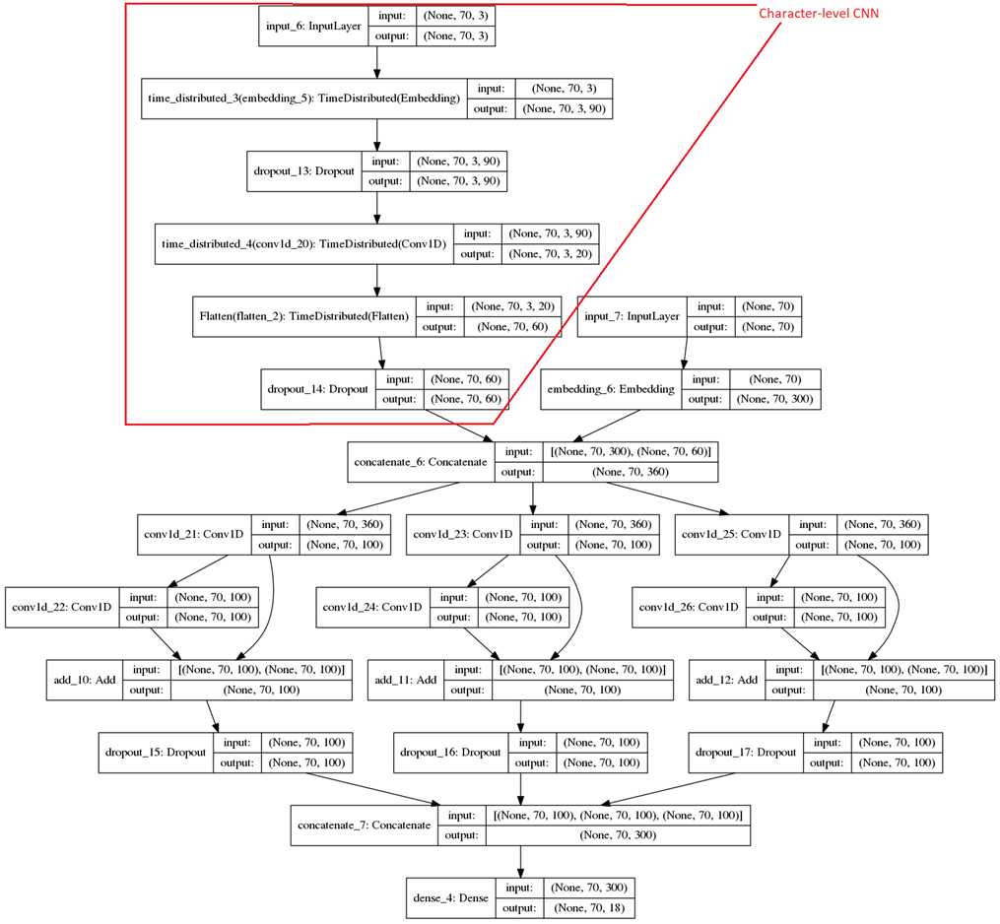
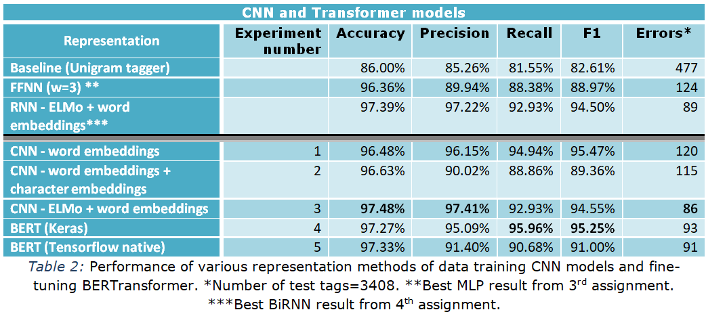

# Α CNN and BERT Transformer based Pos Tagger trained on UD treebank

The task of this work is to develop a part-of-speech (POS) tagger for the English language of the <a href="http://universaldependencies.org/">Universal Dependencies</a> treebanks, using a stacked CNN (<a href="https://eclass.aueb.gr/modules/document/file.php/INF210/slides_2018_19/nlp_slides_part05_nlp_with_cnns_transformers.pdf">slide 18</a>) with n-gram filters (e.g. n = 2,3,4), residuals, and a dense layer with softmax at the top layer implemented in Keras. Note that we use the <a href="https://keras.io/getting-started/functional-api-guide/">functional API of Keras</a>, as it is more suitable for complicated architectures. We also repeat the above task by fine-tuning a pre-trained BERT model firstly with a Keras implementation and secondly with a bert-tensorflow implementation.

In <a href="https://github.com/soutsios/pos_tagger_rnn">Α BiRNN Pos Tagger trained on UD treebank</a>, we reached **97.39%** accuracy, using a one-layer BiRNN with GRU cells, and a concatenation of ELMo deep contextualized word representations with pre-trained word embeddings. We were very interested to compare RNN, CNN and Transformer based models, so we decided to work on this.

It is worth mentioning that we have faced many challenges that we have successfully addressed by implementing our own programming solutions. Many functions are used in different parts of code. For clarity reasons our functions are introduced where firstly used.

Special care was taken for:
1.	Reproducibility reasons -->> seed the numpy generator before every Keras Layer.
2.	Exact accuracy estimation -->> exclude predictions for –PAD- character. To accomplish this, we use function *accuracy_masked_class(to_ignore=0)* as a new accuracy metric and *mask* variable in our *y2label(zipped, mask=0)* where from the flatted label sequence, –PAD- character is excluded.

## CNNs and Tranformer Models
**Convolutional Neural Networks** (**CNNs**), were designed to map image data to an output variable. The CNN input is traditionally two-dimensional, but can also be changed to be one-dimensional, allowing it to develop an internal representation of a one-dimensional sequence, as is the case for NLP tasks. There are two main advantages of CNNs:
- They are computationally more efficient. As RNNs operate sequentially, the output for the second input depends on the first one and so we can’t parallelize an RNN. CNNs have no such problem, each “patch” a convolutional kernel operates on is independent of the other, meaning that we can go over the entire input layer concurrently and take full advantage of GPU parallelism. We have to stack convolutions into deep layers in order to view the entire input and each of those layers is calculated sequentially. But the calculations at each layer happen concurrently and each individual computation is small (compared to an RNN) such that in practice we get a big speed up!
- They process information hierarchically, which makes it easier to capture complex relationships in the data.

Following a different approach from feature-based learning, **Transfer learning** - pre-training a neural network model on a known task, 
and then performing fine-tuning - using the trained neural network as the basis of a new purpose-specific model, was firstly known in the
field of computer vision but can be also useful in many natural language tasks. A new simple network architecture, the **Transformer**,
based solely on attention mechanisms, dispensing with recurrence and convolutions entirely was proposed by paper 
<a href="https://arxiv.org/pdf/1706.03762.pdf">“Attention Is All You Need”</a>. 
BERT makes use of Transformer, to learn contextual representations of words (or sub-words) which can then be fine-tuned with just one additional output layer to create state-of-the-art models for a wide range of NLP tasks.

## Implemented Models
So in this work we experiment with five CNN and Transformer based models that are gradually progressing to the toughest (1-5) as follows:
1.	A 2-layer CNN with pre-trained word embeddings.
2.	Enhance the above model with an extra CNN layer to produce word embeddings from characters, concatenating each resulting character-based word embedding with the corresponding pre-trained word embedding.
3.	Add an extra layer with ELMo deep contextualized word representations to obtain context-sensitive word embeddings and concatenate them with word embeddings.
4.	Fine-tune a pre-trained BERT model ([Keras implementation using Tensorflow Hub module](https://github.com/soutsios/pos-tagger-bert)).
5.	Fine-tune a pre-trained BERT model ([Tensorflow implementation using Uncased BERT-Base checkpoint](https://github.com/soutsios/pos-tagger-bert-tensorflow)).

## CNN - Word embeddings + Character embeddings Model

## Experimental Results - Conclusions
Sequence labeling systems traditionally require large amounts of task-specific knowledge in the form of hand-crafted features and data pre-processing. In this work, we experimented with neural network architectures that benefit from both word- and character-level representations automatically, by using **CNNs and feature-based learning** and also **BERT transformer and transfer learning**.
The results of our 5 experiments are summarized in Table 2 where appropriate evaluation metrics are given for every experiment. A Baseline and also the best result from 3rd and 4th assignment are included.

We finally reached **97.48%** accuracy, using a two-layer CNN, and representations from ELMo and pre-trained word embeddings. The overall conclusion is that CNNs are fast and very accurate. Also  ELMo, due to its high-quality deep context-dependent representations from bidirectional Language Models, gives an important improvement to the POS tagging task.

## Some final points:

1. For word- and character-level representations we used two methods
   - Concatenation of context independent word embeddings with character-based word embeddings.
   - ELMo deep contextualized word representations.
2. ELMo seems to catch basic syntax needed for POS tagging better at first biLM layer than the weighted sum of the 3 layers.
3. Character-level CNN representations seem to not providing a remarkable boost to word only representations, something opposite to our findings in RNN models of 4th assignment. Maybe convolutions learn already something about characters ?
4. Adding ELMo contextualized representations to simple pre-trained word embeddings provides a big improvement. This seems to come from the contextual information and not the sub-word information (especially in the case that our previous claim is right).
5. Fine-tuning a pre-trained BERT model gives very good results, needing only a simple classification layer and no other complex architecture.
6. To present the evaluation results in a unified manner for all 5 experiments wasn’t an easy task. So we used the appropriate transformations and our functions *y2label()*, *make_prediction()*, *find_error()*,  *accuracy_masked_class()* to a lot of tasks like in:
   - Classification report
   - Make a prediction for a test sentence
   - Tag an unknown sentence
   - Frequent types of mistakes
   - Accuracy estimation during training

